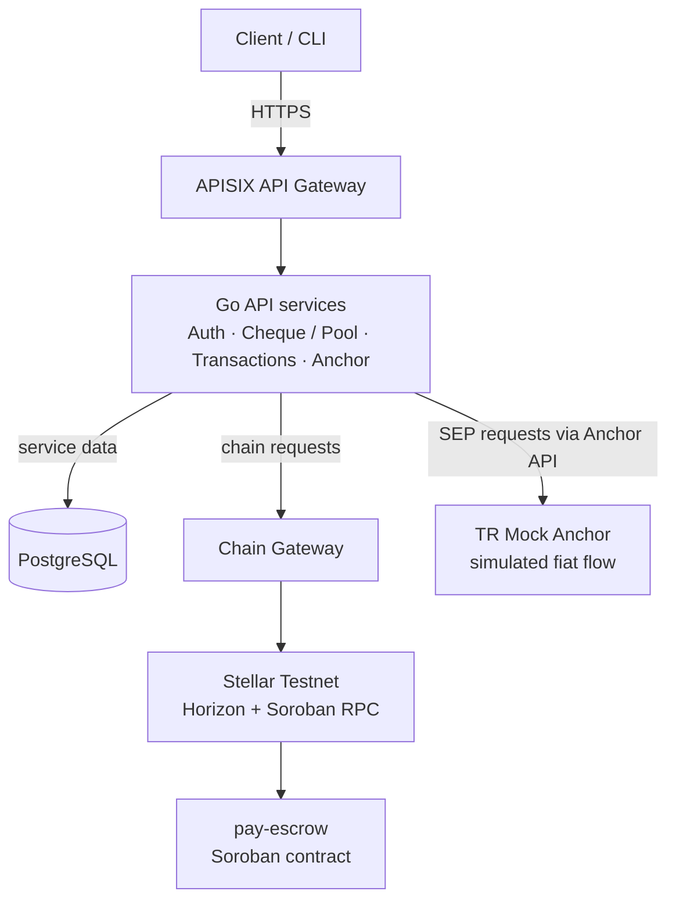

<p align="center">
  <picture>
    <source media="(prefers-color-scheme: dark)" srcset="docs/assets/mascot-dark.svg">
    
  </picture>
</p>

<h1 align="center">ghoStellar</h1>

<p align="center">
  <strong>Send a Stellar payment like sending a note.</strong><br>
  A non-custodial P2P payment backend for Turkish lira to testnet USDC flows, expiring cheques, and shared pools.
</p>

<p align="center">
  <a href="https://stellar.org/">Stellar</a> ·
  <a href="https://developers.stellar.org/docs/build/smart-contracts/overview">Soroban</a> ·
  <a href="https://github.com/buraksal52/ghoStellar/blob/main/LIMITATIONS.md">Known limitations</a> ·
  <a href="https://github.com/buraksal52/ghoStellar/tree/main/docs/reference/platform">Technical docs</a>
</p>

<p align="center">
  
  
  
  
</p>

> **Project status:** Backend, Soroban contract, and Flutter client source are in the repository. The API has a Railway deployment, but there is no hosted client or public, judge-ready interactive demo. The anchor is a **mock**: its bank transfer is simulated, so this project does not currently move real Turkish lira.

## The idea

In Turkey, everyday shared expenses and small person-to-person payments still rely on bank transfers and informal tracking. ghoStellar explores a transparent, programmable way to send and hold value: a sender creates a time-limited **Cheque**, a recipient claims it, and an unclaimed cheque can be refunded after its expiry. A **Pool** provides a shared or personal place to deposit testnet assets.

The intended users are people who need simple, auditable transfers for situations such as family support, shared rent, or settling small debts. The product aims to make the payment state easy to verify while keeping user signing keys on the user's device; the backend prepares unsigned transactions and coordinates the API flow.

## What works today

- **Soroban escrow contract** deployed to Stellar Testnet: [`pay-escrow`](contracts/soroban/pay-escrow/README.md).
- **Cheque lifecycle:** lock, claim, refund after expiry, and force collect.
- **Pool lifecycle:** deposit and withdraw through the escrow contract.
- **Six Go services:** authentication, chain gateway, cheque and pool API, transaction submission, anchor proxy, and expiry scheduler.
- **Flutter client:** mobile app source for onboarding, sending/receiving, Pools, anchor deposits/withdrawals, and activity. See [`frontend/README.md`](frontend/README.md).
- **SEP-based mock anchor flow:** SEP-1 discovery and SEP-6/10/12/38 support around a testnet USDC asset. The mock anchor simulates the bank leg; it is not a real-money on/off-ramp.
- **Local checks:** Go unit and handler tests, Soroban contract tests, CI, smoke checks, and a scripted happy-path E2E flow.

### Contract and testnet asset

| Item | Value |
|---|---|
| Network | Stellar Testnet |
| Contract | [`pay-escrow`](https://stellar.expert/explorer/testnet/contract/CDD7FWHQIAF2Z57CMZUO5BT4TY4VTIZKXLYD4WKQ7HDLO5IQOYU6V3ID) |
| Contract ID | `CDD7FWHQIAF2Z57CMZUO5BT4TY4VTIZKXLYD4WKQ7HDLO5IQOYU6V3ID` |
| Test asset | TR Mock Anchor testnet USDC |
| USDC issuer | `GBBD47IF6LWK7P7MDEVSCWR7DPUWV3NY3DTQEVFL4NAT4AQH3ZLLFLA5` |
| USDC Stellar Asset Contract | `CBIELTK6YBZJU5UP2WWQEUCYKLPU6AUNZ2BQ4WWFEIE3USCIHMXQDAMA` |

The contract README documents deployment commands and artifacts. Do not send real funds to this testnet project.

## Hackathon requirements and current fit

The handbook describes the following as core requirements for both tracks. This table records the repository's current state; it does not imply that the project is eligible for a track.

| Requirement | Current state |
|---|---|
| Integrate an existing Stellar protocol from the eligible partner list or full SCF Integration List | **Not met.** `pay-escrow` is a project-owned contract; the repository does not show an integration with an eligible external protocol such as DeFindex, Blend, Aquarius, or Soroswap. |
| Anchor or local payments: real TRY in/out and a usable Stellar balance | **Partially demonstrated with a mock only.** SEP flows connect to TR Mock Anchor and testnet USDC, but the bank transfer is simulated. No real TRY is moved. |
| Integration is load-bearing to the product | The Soroban escrow contract powers Cheque and Pool operations. The required eligible third-party protocol integration remains absent. |
| Deployed, functional Stellar Testnet application and contract artifacts | **Partially met.** The Soroban contract is deployed and documented; Flutter client source is present and the API has a Railway deployment. A hosted client URL and public interactive demo are not available. |
| Core flows, edge cases, and contract verification | Contract tests and local service tests exist. The scripted E2E covers the lock-to-claim happy path; force collect, expiry refund, and pool are not scripted end to end through the services. The force-collect authorization XDR has not been validated on a live testnet flow. |
| Scale Track documentation | The README includes a Mermaid architecture diagram. The handbook also asks Scale submissions for an accurate architecture diagram and a post-hackathon SCF/InstAward roadmap. Track selection and Scale eligibility must be confirmed by the team. |

The PDF also asks teams to cite the Stellar Skill files used. This project used [`SKILL.md`](SKILL.md), the TR Mock Anchor integration guide in this repository, covering SEP-1/6/10/12/38. See [Stellar Skills](https://skills.stellar.org/) for the official skill library.

Track eligibility is separate from technical readiness: Genesis is open to teams of up to four; Scale is invite-only and has additional experience and ecosystem-value expectations. Confirm eligibility and track choice with the organizers before submission.

## How a payment moves through the system

1. A user authenticates and gets an unsigned transaction from the API.
2. The user's client signs the transaction and submits it through the transaction service.
3. The `pay-escrow` Soroban contract locks the cheque amount.
4. The recipient claims the cheque, or the scheduler can trigger a refund once it expires.

For the mock anchor path, the anchor service discovers SEP endpoints, obtains an anchor token, and proxies transfer requests. The mock's simulated bank-transfer step is for testnet demonstrations only.

## Architecture

The overview below shows the local microservice profile. The Railway API deployment runs the monolith profile; see [Railway deployment](docs/deploy/railway.md).



The scheduler is a separate internal worker. It calls the Cheque service and Chain Gateway; it is not exposed through the public API gateway. The diagram groups service internals so the main request and settlement paths stay readable.

| Component | Responsibility |
|---|---|
| `pay-auth-service` | SEP-10 authentication, RS256 access and refresh tokens |
| `pay-chain-gateway` | Single Horizon and Soroban RPC boundary |
| `pay-cheque-service` | Cheque and Pool state, reservation ledger, unsigned XDR construction |
| `pay-tx-service` | Transaction submission and idempotency keys |
| `pay-scheduler-service` | Permissionless expired-cheque refunds using a fee-paying keeper account |
| `pay-anchor-service` | SEP-1 discovery and SEP-6/10/12/38 proxy, trustline XDR |
| `pay-escrow` | On-chain Cheque and Pool lifecycle |

More detail: [platform architecture](docs/reference/platform/architecture.md), [anchor integration flow](docs/reference/platform/anchor-integration.md), and [Cheque/Pool design](docs/reference/platform/cheque-and-pool-design.md).

## Stellar protocols and design choices

- **SEP-1** discovers the mock anchor's published endpoints and asset information.
- **SEP-6** provides the mock deposit/withdraw transfer flow; **SEP-10** authenticates with the anchor and with this backend; **SEP-12** exposes the mock KYC flow; **SEP-38** supports optional quotes.
- **Soroban** owns the Cheque and Pool lifecycle in one contract. This keeps the cheque's expiry, claim, refund, and force-collect state in one on-chain model.
- **Stellar Asset Contract (SAC)** represents the testnet USDC used by the escrow contract.
- Amounts use integer arithmetic (`big.Int` plus an explicit decimal count), not `float64`.
- The anchor JWT remains on the client. As a result, the scheduler cannot independently poll anchor transaction status; the client reports the status it observes.
- The keeper pays network fees for permissionless refunds and has no authority to take user funds.

### Technical challenges addressed

- Built the Soroban contract with the `wasm32v1-none` target after the default WebAssembly target produced unsupported reference-types output.
- Kept `force_collect` authorization in the same contract state model as Pool and Cheque operations.
- Fixed APISIX route configuration issues and made optional SEP-38 discovery best-effort so it does not block other anchor capabilities.
- Added a synchronized runtime host allow-list for anchor hosts discovered from SEP-1 metadata.

## Limitations and open work

Known limitations are tracked in [`LIMITATIONS.md`](LIMITATIONS.md). The most relevant submission and technical gaps are:

- No eligible third-party Stellar protocol integration is present yet.
- The TR Mock Anchor is not a real fiat rail; bank transfer is simulated.
- The Flutter client source is present, but no hosted client URL or publicly accessible interactive demo is available.
- The `/sync` endpoint reads the local database cache rather than independently verifying contract state on-chain.
- The live-network `force_collect` authorization flow is unverified, and service-level E2E coverage is limited to the happy path.
- Mock SEP proxy currently supports JSON bodies only; real-anchor multipart KYC uploads are not supported.
- Postgres integration tests are not present; audit/trustline tables are not fully used; pending idempotency keys are not recovered after a crash.
- Scheduler submission bypasses the transaction service, expired-cheque sweeps lack backoff/dead-letter handling, and service ports can bypass APISIX controls.
- Monolith profile is not implemented; down migrations are not available; JWT `aud`/`iss` claims are absent.
- The repository does not document verified user traction or feedback collected during the event.

These limitations are part of the current implementation record, not a promise that the items are already fixed. See [`LIMITATIONS.md`](LIMITATIONS.md) for details and closure paths.

## Run locally

### Requirements

- Docker Engine with the Docker Compose plugin
- Git
- A Stellar Testnet account and testnet funds for running the network E2E flow

### Start the services

```sh
git clone https://github.com/buraksal52/ghoStellar.git
cd ghoStellar

bash scripts/setup-secrets.sh
```

Set `SEP10_SIGNING_SEED` and `KEEPER_SECRET_SEED` in `deploy/.env` using your own testnet keys. Never commit real secrets. The compose environment also needs reachable Stellar Testnet and TR Mock Anchor endpoints.

```sh
bash scripts/dev-up.sh
bash scripts/smoke.sh
```

The E2E script uses the live Stellar Testnet and the mock anchor; it is not an offline test and currently covers the lock-to-claim happy path:

```sh
bash scripts/e2e.sh
```

### Run tests

```sh
cd backend && go test ./...
cd contracts/soroban/pay-escrow && cargo test
```

The repository CI also runs Go formatting, build, vet, race tests, and Soroban contract tests. These checks do not replace the still-missing Postgres integration tests or full service-level E2E scenarios.

## Impact, traction, and next steps

The product targets everyday P2P transfers and shared expenses in Turkey. The repository does not currently provide verified real-user or adoption metrics; no traction figures are claimed here.

Suggested next milestones are to integrate an eligible Stellar ecosystem protocol, provide a publicly accessible interface and demo, validate all contract flows on Testnet, and replace the mock payment leg before claiming real fiat support. A post-hackathon SCF or InstAward application is a possible direction, subject to track eligibility and further product validation.

## Submission details

The handbook requires these items in the judging portal. Fill in the project-specific links and team details before submitting:

| Submission item | Value |
|---|---|
| Team name | Add before submission |
| Team members and contact details | Add each member's full name and contact information in the portal |
| Track selection | Confirm in the portal; only selected tracks are evaluated |
| GitHub repository | [buraksal52/ghoStellar](https://github.com/buraksal52/ghoStellar) |
| Backend deployment | [Railway API health endpoint](https://ghostellar-production.up.railway.app/health) |
| Live app / interactive demo URL | Not available; the backend API deployment is not a user-facing demo |
| Pitch deck | Create a copy of the official template; add the share link here |

Scale Track applicants should also add a post-hackathon roadmap toward SCF/InstAward and confirm the eligibility requirements. Do not edit the shared presentation template directly; use a copy and make it viewable to anyone with the link.

## Repository layout

```text
backend/                    Go module and six payment services
contracts/soroban/pay-escrow/ Soroban escrow contract and contract guide
deploy/                     Docker Compose, APISIX, migrations, example config
scripts/                    Local setup, smoke, and E2E scripts
frontend/                   Flutter mobile client
docs/reference/platform/    Architecture and integration documents
docs/assets/                README mascot artwork
```

## References

- Rise In × Stellar Pro Hackathon 2026 Tracks Handbook (the attached handbook) — requirements informed the status and submission sections above.
- [Stellar Skills](https://skills.stellar.org/) — includes the Anchor integration guidance used during development.
- [`SKILL.md`](SKILL.md) — project-specific TR Mock Anchor integration skill.
- [`LIMITATIONS.md`](LIMITATIONS.md) — detailed limitations and planned closure paths.
- [Stellar Testnet contract explorer](https://stellar.expert/explorer/testnet/contract/CDD7FWHQIAF2Z57CMZUO5BT4TY4VTIZKXLYD4WKQ7HDLO5IQOYU6V3ID).
