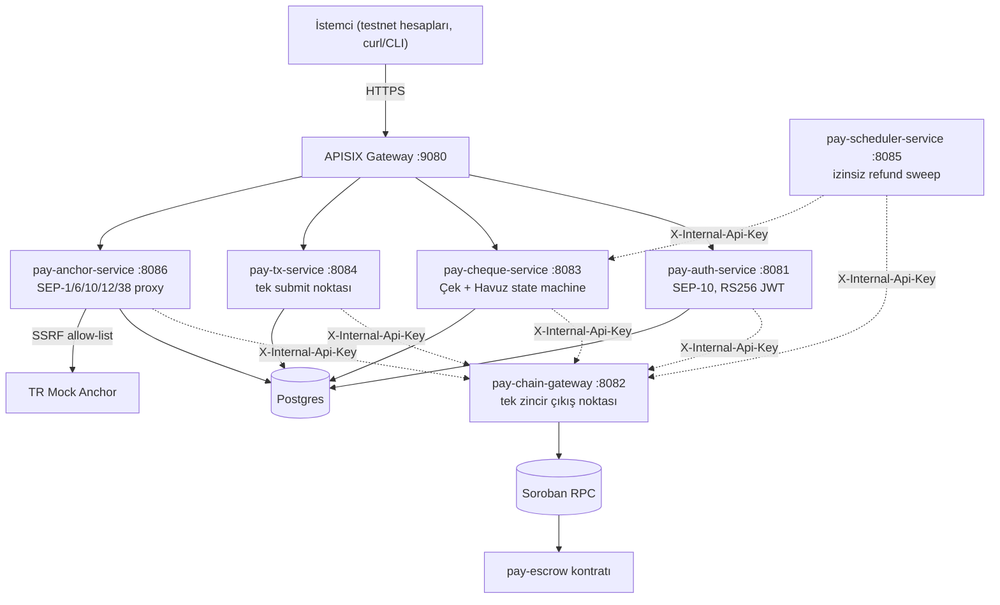

# Local-Payment

Stellar üzerinde non-custodial P2P ödeme uygulaması: kişiden kişiye "Çek"
gönderimi, ortak/kişisel "Havuz" mevduatı, ve TR Mock Anchor üzerinden
gerçek bir fiat rayı (TRY girer, kullanılabilir bir Stellar bakiyesi
çıkar — ya da tersi).

**Kullanılan Stellar Skill:** [`SKILL.md`](SKILL.md) — TR Mock Anchor'ın
SEP-1/6/10/12/38 entegrasyon rehberi; `pay-anchor-service`'in tamamı bu
dosyaya göre yazıldı. Ayrıca bkz. [skills.stellar.org — Anchors](https://skills.stellar.org/)
(genel SEP akışları referansı).

## 1. Narrative — Ne, Neden, Kimin İçin

**Ne inşa ediyoruz:** Türkiye'de biri diğerine kripto bilmeden para
gönderebilsin diye — banka hesabından TRY yatırır, karşı taraf bunu
Stellar üzerinde bir "Çek" olarak alır, istersen hemen nakde çevirir
istersen "Havuz"da (kilitli, faizsiz bir kişisel kasa gibi) bekletir.
Tüm bu süreçte hiçbir özel anahtar bizim sunucularımızdan geçmez —
kullanıcı kendi anahtarını kendi cihazında tutar, biz yalnızca imzasız
işlem üretiriz.

**Hangi problemi çözüyor:** Klasik P2P para transferi (havale, IBAN)
Türkiye'de saatler/günler sürebilir, banka çalışma saatlerine bağlıdır,
ve "param nereye gitti, ne zaman ulaşacak" belirsizdir. Stellar'ın
5 saniyelik ledger kapanışı + Soroban'ın programlanabilir kontratları,
bunu saniyeler içinde, geri dönüşü kanıtlanabilir, kimsenin parayı
"kaybedemeyeceği" bir modele çevirir — çek yazıldığı an tutar rezerve
edilir, alıcı almazsa 1 hafta sonra otomatik geri döner, hiçbir ara
durumda para "havada" kalmaz.

**Hedef kullanıcı:** Kripto bilmeyen, Türk lirasıyla düşünen, ama hızlı
ve şeffaf bir kişiden kişiye ödeme isteyen herkes — özellikle aile içi
para paylaşımı (öğrenciye harçlık, ortak kira havuzu) ve arkadaşlar
arası borç kapatma gibi düşük tutarlı, sık tekrarlanan transferler.

**Değer önerisi:** Non-custodial (biz asla parana el süremeyiz),
zincir-üstü kanıtlanabilir durum makinesi (çek her zaman tam olarak tek
bir durumda — asla "belki gitti belki gitmedi"), ve gerçek bir TRY
giriş/çıkış kapısı (TR Mock Anchor) — demo değil, gerçek SEP-6 akışıyla
çalışan bir fiat rayı.

## 2. MVP — Teslim Edilenler

- **Public GitHub repo:** bu repo (`ghoStellar`), commit geçmişi dahil.
- **Deployed smart contract (Stellar Testnet):**
  `contracts/soroban/pay-escrow`, soroban-sdk 22 ile yazıldı, 17 test
  geçiyor (`cargo test`).
  **Contract ID:** [`CDD7FWHQIAF2Z57CMZUO5BT4TY4VTIZKXLYD4WKQ7HDLO5IQOYU6V3ID`](https://stellar.expert/explorer/testnet/contract/CDD7FWHQIAF2Z57CMZUO5BT4TY4VTIZKXLYD4WKQ7HDLO5IQOYU6V3ID)
  Deploy komutu ve wasm hash için: [`contracts/soroban/pay-escrow/README.md`](contracts/soroban/pay-escrow/README.md).
- **Kullanılan varlık:** TR Mock Anchor'ın testnet USDC'si —
  `GBBD47IF6LWK7P7MDEVSCWR7DPUWV3NY3DTQEVFL4NAT4AQH3ZLLFLA5`, SAC adresi
  `CBIELTK6YBZJU5UP2WWQEUCYKLPU6AUNZ2BQ4WWFEIE3USCIHMXQDAMA`.
- **Backend (6 mikroservis):** aşağıya bakın — `docker compose up` ile
  yerelde tam ayağa kalkar, `scripts/smoke.sh` ile doğrulanır.
- **Front-end / canlı public demo:** **henüz yok.** Bu depo bilinçli
  olarak yalnızca backend'i kapsıyor (bkz. `SERVICE.md` madde 9); API
  sözleşmesi kendi başına eksiksiz ve `scripts/e2e.sh` ile uçtan uca
  test edilebilir, ama judge'ların tıklayabileceği bir web/mobil arayüz
  ya da public URL bu teslimde yok.

## 3. Technical Docs

### Overall architecture



Tam diyagram (Horizon dahil) ve ASCII karşılığı:
[`docs/reference/platform/architecture.md`](docs/reference/platform/architecture.md) §1.

### Main components and responsibilities

| Servis | Port | Sorumluluk |
|---|---|---|
| `pay-auth-service` | 8081 | SEP-10 challenge/verify, RS256 JWT + refresh |
| `pay-chain-gateway` | 8082 | Tek Horizon + Soroban RPC çıkışı (SSRF allow-list) |
| `pay-cheque-service` | 8083 | Çek durum makinesi, Havuz, rezerv defteri, XDR üretimi, Forced Sync |
| `pay-tx-service` | 8084 | Tek submit noktası, Idempotency-Key |
| `pay-scheduler-service` | 8085 | Süresi dolan çeklerin izinsiz iadesi (keeper hesabıyla) |
| `pay-anchor-service` | 8086 | SEP-1/6/10/12/38 proxy (TR Mock Anchor, USDC), trustline XDR |
| `pay-escrow` (Soroban) | — | Çek + Havuz'un tüm zincir-üstü hayat döngüsü |

Tam sorumluluk sınırları: [`CLAUDE.md`](CLAUDE.md) "Kurulmuş Kalıplar".

### Stellar integrations and protocols used

- **SEP-10** (iki ayrı bağlamda: bize karşı `pay-auth-service`, anchor'a
  karşı `pay-anchor-service` proxy'si) — kimlik doğrulama, şifre yok.
- **SEP-1** — TR Mock Anchor'ın `stellar.toml`'unu çözüp `WEB_AUTH_ENDPOINT`/
  `TRANSFER_SERVER`/`KYC_SERVER`/`ANCHOR_QUOTE_SERVER`'ı keşfeder.
- **SEP-6** — deposit/withdraw (TRY ↔ USDC), bkz. [`SKILL.md`](SKILL.md).
- **SEP-12** — KYC proxy (mock anchor otomatik onaylıyor).
- **SEP-38** — quote/fiyat proxy'si (opsiyonel özellik).
- **Soroban** — `pay-escrow` kontratı: `lock`/`claim`/`refund`/
  `force_collect` (Çek) + `deposit`/`withdraw` (Havuz). Soroban
  `SorobanAuthorizationEntry` ile ön-yetkili "zorla tahsil" akışı.
- **Stellar Asset Contract (SAC)** — USDC'nin klasik Stellar varlığı,
  `pay-escrow`'un `token::Client` ile hareket ettirdiği SAC adresi
  üzerinden kontrata bağlanıyor.

Şu an entegre **olmayan**, handbook'un "Eligible Integration Partners"
listesindeki bir protokol (DeFindex, Blend v2, vb.) yok — bkz. altta
"Bilinçli kapsam dışı bırakılanlar".

### Key design decisions and trade-offs

- **Çek'in tüm hayat döngüsü tek Soroban kontratında**, klasik Claimable
  Balance kullanılmıyor — gerekçe: "zorla tahsil" (force_collect)
  koşulunun ("havuz hiç fonlanmadı mı?") zincir üstünde doğrulanabilir
  olması ancak tek bir kontrat state'iyle mümkün; iki mekanizma
  (Claimable Balance + Soroban) birlikte kullanılsaydı bu kontrol
  backend'e emanet edilirdi, "zincir otoritedir" ilkesini bozardı. Tam
  gerekçe: `contracts/soroban/pay-escrow/src/lib.rs` modül dokümanı.
- **Tek Go modülü, `internal/` yok** — De-Fi referans projesindeki
  monolith tam bu yüzden hiç derlenememişti (`internal/` görünürlük
  kuralı paketler arası import'u engelliyordu). Servisler birbirini
  import etmiyor; `backend/ports` bir `ChainGateway` interface'i
  tanımlıyor, `httpadapter`/`directadapter` iki gerçekleme.
  Bkz. `CLAUDE.md`.
  Ödün: gelecekteki bir monolith profili için `directadapter`
  eksik (bkz. `SERVICE.md` madde 4).
- **Anchor JWT'si asla saklanmaz** — yalnızca cihazda kalır. Bu, işlem
  durumunun `pay-scheduler-service` tarafından bağımsız sorgulanamaması
  anlamına geliyor (anchor'ın SEP-10 yetkisi gerektirir); istemci kendi
  gözlemini `POST /anchors/{id}/transactions/{txId}/report` ile bildirir.
  Kabul edilen bir ödün — bkz. `docs/reference/platform/anchor-entegrasyonu.md`.
- **Para hiçbir yerde `float64` değil** — `pkg/money.Amount`
  (`*big.Int` + `decimals uint8`), API sınırında her zaman string.
  Postgres'te `NUMERIC(40,0)` + ayrı `decimals SMALLINT`.
- **Keeper hesabı, custodial değil** — `pay-scheduler-service`'in kendi
  testnet hesabı yalnızca izinsiz `refund()` çağrılarının ağ ücretini
  öder; hiçbir kullanıcı fonuna yetkisi yok (kontratın kendi mantığı
  yalnızca "süre doldu mu" kontrolü yapıyor, çağıranın kimliğine
  bakmıyor).

### Technical challenges and how we solved them

- **`wasm32-unknown-unknown` deploy'u `reference-types not enabled`
  hatasıyla reddedildi.** Rust 1.82+ bu hedef için reference-types'ı
  varsayılan açıyor, Soroban host'u henüz desteklemiyor. Çözüm:
  `wasm32v1-none` hedefine geçmek (`rustup target add wasm32v1-none`).
  Detay: `contracts/soroban/pay-escrow/README.md`.
- **Force-collect'in ön-yetkisi, klasik Claimable Balance ile birlikte
  kullanılamıyordu** (bkz. yukarıdaki "Key design decisions").
  Çözüm: tüm hayat döngüsünü tek kontrata taşımak.
- **APISIX `limit-req` route'ları sessizce 404 dönüyordu.** Sebep:
  YAML anchor'ı (`&ratelimit`) yanlışlıkla kendi anahtarını
  (`limit-req:`) da içeriyordu, çift sarmalama oluşturuyordu — APISIX
  şema doğrulaması route'u reddedip logluyordu ama HTTP cevabı
  belirsiz bir 404'tü. Çözüm: anchor'ı düzleştirmek.
  (Kalıcı ders: APISIX standalone modda şema hatası veren bir route
  sessizce devre dışı kalır — `docker logs <apisix>` her zaman kontrol
  edilmeli.)
- **`pay-anchor-service`'in `Info()` metodu, opsiyonel bir SEP-38 alanı
  (SDK'da eksik `ANCHOR_QUOTE_SERVER`) yüzünden SEP-10/SEP-6'yı da
  kilitliyordu** — ikinci bir toml çekme çağrısının geçici hatası tüm
  anchor işlevini durduruyordu. Çözüm: bu çağrıyı best-effort yaptık.
- **Anchor'ın SEP-1 toml'u, `ANCHOR_DOMAIN`'den farklı bir host'a
  delege edebilir** (SSRF allow-list'i kilitlerdi). Çözüm:
  `pkg/nethost`'a çalışma zamanında host ekleyebilen, mutex-korumalı
  bir allow-list eklendi (`AddAllowedHost`).

Bu üç bulgu (ve üç tane daha) `git log`'daki `fix(anchor): fix 6 review
findings` commit'inde detaylı açıklanmıştır.

## 4. Bilinçli Kapsam Dışı Bırakılanlar

Handbook'un iki gereksinimini bu teslimde **bilerek** kapatmadık (kod
tabanının geri kalanı bunlara hazır, ama zaman/kapsam kararı olarak
ertelendi):

1. **Eligible Integration Partners listesinden bir protokol yok**
   (DeFindex, Blend v2, Aquarius, Soroswap, vb.). En doğal aday:
   Havuz'daki atıl parayı DeFindex vault'una yönlendirmek — ürünün
   kendi mantığına (para boşta durmasın) tam oturur, ama backend'e yeni
   bir entegrasyon katmanı gerektirir.
2. **Front-end / canlı public demo yok.** Yalnızca backend var; API
   `scripts/e2e.sh` ile uçtan uca test edilebilir ama judge'ların
   tıklayabileceği bir arayüz/URL yok.

Tam liste ve gerekçeleri: [`SERVICE.md`](SERVICE.md).

## Dizin Yapısı

```
backend/     Tek Go modülü: pay-auth/chain-gateway/cheque/tx/anchor/scheduler
contracts/   pay-escrow Soroban kontratı (Rust) — testnet'e deploy edildi
deploy/      docker-compose, Dockerfile, APISIX, migrations, .env
scripts/     setup-secrets / dev-up / smoke / e2e
docs/        mimari referans dokümanları
```

## Hızlı Başlangıç

```sh
bash scripts/setup-secrets.sh
# deploy/.env zaten deploy edilmiş contract ID'lerle geliyor; yalnızca
# SEP10_SIGNING_SEED ve KEEPER_SECRET_SEED'i kendi testnet anahtarlarınızla
# doldurun (bkz. dosyanın içindeki yorumlar).

bash scripts/dev-up.sh
bash scripts/smoke.sh
bash scripts/e2e.sh    # testnet uçtan uca: SEP-10, SEP-6 deposit, çek yaz/claim
```

## Test

```sh
cd backend && go test ./...
cd contracts/soroban/pay-escrow && cargo test
```
