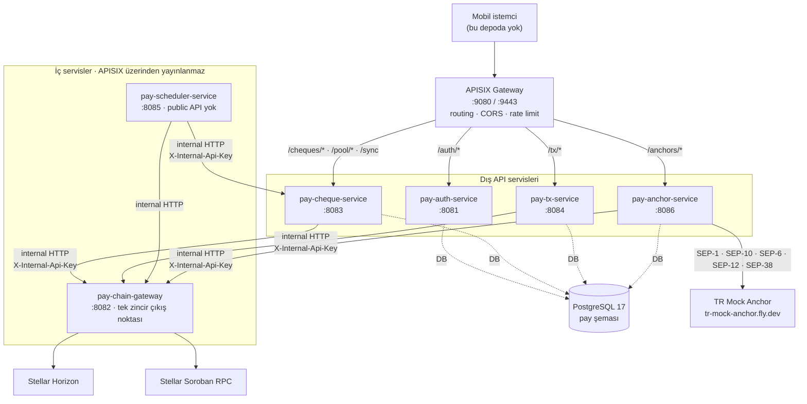
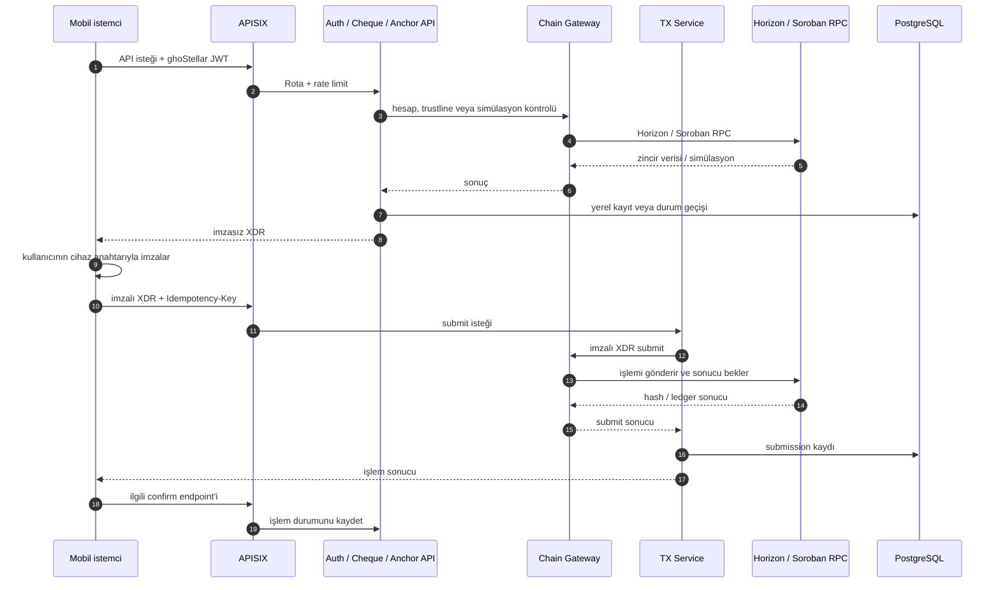
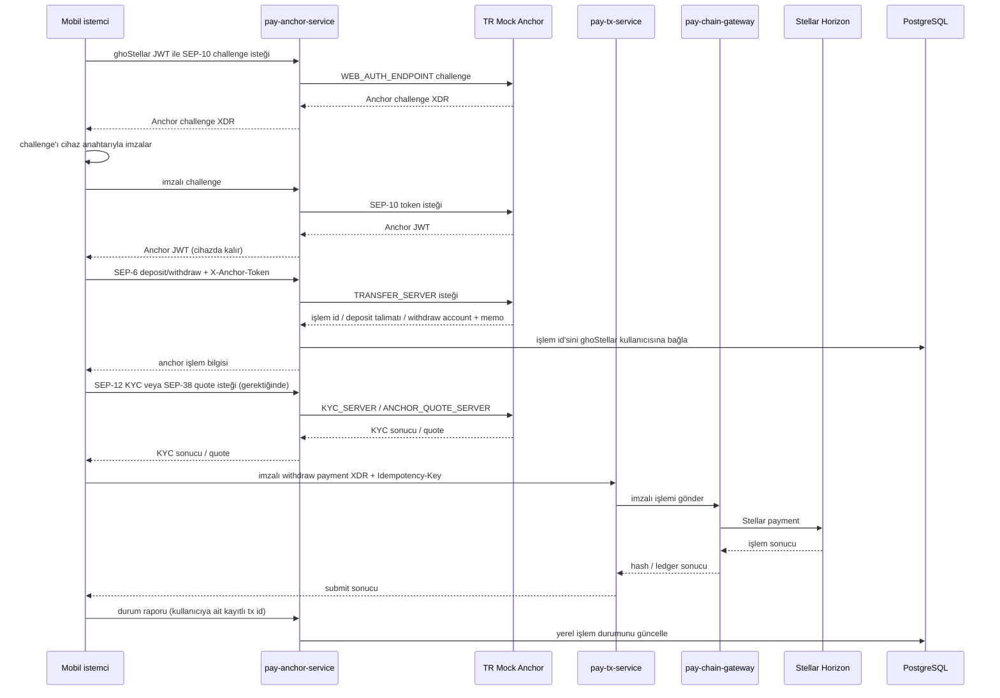

# ghoStellar Backend Mimarisi

Bu dosya ghoStellar backend'inin güncel mimarisini gösterir. Servis
envanteri ve akışlar depo içindeki `backend/`, `contracts/` ve `deploy/`
yapılandırmalarıyla eşleştirilmiştir.

| | |
|---|---|
| **Kapsam** | P2P Çek + Havuz + Anchor on/off-ramp |
| **Zincir** | yalnızca Stellar (Horizon + Soroban RPC) |
| **Diller** | Go (backend) + Rust (Soroban kontratı) |
| **Custody** | non-custodial. Backend hiçbir kullanıcı özel anahtarını tutmaz. |
| **Frontend** | bu depoda yok — bkz. `CLAUDE.md` |

## 1. Çalışan Sistem Topolojisi



Docker Compose servisleri ayrı process'ler olarak çalıştırır ve tek Postgres
instance'ını kullanır. Tablolar `pay` şemasında olsa da servisler yalnızca
kendi sorumluluğundaki tablolara erişir. APISIX dış API yollarını yönlendirir;
scheduler ve chain-gateway'in iç uçları edge'den yayınlanmaz.

`pay-auth-service` Horizon/Soroban'a çıkmaz. Scheduler'ın kendi HTTP API'si
yoktur; süre aşımı ve TTL işleri için cheque-service ile chain-gateway'i
internal HTTP üzerinden çağırır.

### İstek ve imzalı işlem akışı



### Anchor on/off-ramp akışı



Anchor JWT kalıcı depoya yazılmaz. SEP-6 `/info` dışında proxy uçları
`X-Anchor-Token` bekler. İstemcinin gönderdiği deposit `account` alanı,
ghoStellar JWT'sindeki Stellar adresiyle eşleştirilir. Anchor işlem durumu halen
istemci raporuna dayanır; backend anchor'dan bağımsız doğrulama yapmaz. Ayrıntı:
[`anchor-entegrasyonu.md`](anchor-entegrasyonu.md).

<details>
<summary>Genel topolojinin ASCII hâli (Mermaid render olmayan ortamlar için)</summary>

```
                    +------------------------------+
                    |     APISIX Gateway (:9080)    |
                    |  routing / CORS / ratelimit   |
                    +---------------+----------------+
   +----------+----------+----------+----------+----------+
   |          |          |          |          |
+--v--+  +----v----+  +--v--+  +----v----+  +--v------+
|auth |  | cheque  |  | tx  |  | anchor  |  |scheduler|
|:8081|  | :8083   |  |:8084|  | :8086   |  | :8085   |
+--+--+  +----+----+  +--+--+  +----+----+  +----+----+
   |          |            |         |             |
   +----------+---(internal HTTP, X-Internal-Api-Key)---+
                          |
                +---------v----------+
                |  pay-chain-gateway |  <- tek zincir cikis noktasi
                |    (:8082)         |
                +---------+----------+
                          |
              +-----------+-----------+
              |                       |
      +-------v-------+     +---------v---------+
      |  Horizon API  |     |   Soroban RPC     |
      +---------------+     +-------------------+
```

`pay-escrow` kontratı (testnet:
`CDD7FWHQIAF2Z57CMZUO5BT4TY4VTIZKXLYD4WKQ7HDLO5IQOYU6V3ID`) Soroban RPC'nin
arkasında yaşar; Çek + Havuz'un tüm zincir-üstü durumu orada tutulur.

</details>

## 2. Servis Envanteri

| Servis | Port | Sorumluluk |
|---|---|---|
| `pay-auth-service` | 8081 | SEP-10 challenge/verify, RS256 JWT + refresh, kullanıcı profili |
| `pay-chain-gateway` | 8082 | Tek Horizon + Soroban RPC çıkışı |
| `pay-cheque-service` | 8083 | Çek durum makinesi, Havuz, rezerv defteri, imzasız XDR, Forced Sync |
| `pay-tx-service` | 8084 | Tek submit noktası, Idempotency-Key |
| `pay-scheduler-service` | 8085 | Süresi dolan çeklerin izinsiz iadesi (keeper hesabıyla) |
| `pay-anchor-service` | 8086 | SEP-1/SEP-10, SEP-6/12/38 proxy, işlem defteri ve trustline XDR; SEP-24 uyumluluğu |

Servis sınırları (kod tarafından zorlanır, yalnızca kural olarak değil):

1. Servisler birbirinin Postgres tablosunu okumaz — kimlik geçişi bir
   `stellar_address` sütunu olarak taşınır, `pay.users(id)`'e FK ile değil.
2. Yalnızca `pay-chain-gateway` Horizon/Soroban'a çıkar
   (`backend/services/chain`); diğerleri `ports.ChainGateway` üzerinden
   çağırır (`ports/httpadapter` mikroservis modunda, `ports/directadapter`
   gelecekteki monolith modunda — bkz. `SERVICE.md` madde 4).
3. Yalnızca `pay-tx-service` imzalı XDR submit eder.
4. Hiçbir serviste kullanıcı özel anahtarı yok. `pay-auth-service`'in
   SEP-10 sunucu imzalama anahtarı ve `pay-scheduler-service`'in keeper
   anahtarı, kullanıcı fonlarını hareket ettirme yetkisi taşımayan iki
   istisnadır (anchor kararı için
   [`anchor-entegrasyonu.md`](anchor-entegrasyonu.md) belgesine bakın).
5. Servisler arası çağrıda `X-Internal-Api-Key` zorunlu.
6. Boş env var = özellik kapalı + fallback (`SOROBAN_RPC_URL` boşsa
   chain-gateway yalnız Horizon modunda açılır).

## 3. Çek + Havuz'un Zincir Üstü Temsili

`contracts/soroban/pay-escrow` — tek kontrat, hem Çek hem Havuz. Klasik
Claimable Balance MVP'de **kullanılmaz**; gerekçe kontratın kendi
`lib.rs`'indeki modül dokümanındadır. Fonksiyonlar, durumlar ve
değişmezlerin (D1-D9) kontrat
karşılığı için `contracts/soroban/pay-escrow/README.md`'ye bakın.

## 4. Para ve Sayı Tipleri

`backend/pkg/money.Amount` tipi
(`Raw *big.Int` + `Decimals uint8`), API sınırında her zaman string,
Postgres'te `NUMERIC(40,0)` + `decimals SMALLINT`, `DOUBLE PRECISION` yasak.

## 5. Kimlik, Yetki, Güvenlik

- SEP-10 → RS256 JWT (`backend/pkg/authx`). Özel anahtar yalnızca
  `pay-auth-service`'te.
- Servisler arası: `X-Internal-Api-Key` (`authx.RequireInternalKey`).
- Dışarı çıkan tüm HTTP (Horizon, Soroban RPC, anchor) `pkg/nethost`
  SSRF allow-list'inden geçer.
- Idempotency: para hareketi doğuran her POST `Idempotency-Key` ister
  (`pay.idempotency_keys`, 24 saat TTL).

## 6. Kontrat + Servis Sınırındaki Sorumluluk Ayrımı

Backend, kontratın kendi kendine yeten kontrollerini (D2, H2, G5)
**tekrar etmez** — yalnızca kullanıcıya hızlı, açıklayıcı bir hata dönmek
için önden ucuz bir kontrol yapar (örn. `pool.withdraw_locked`'ı ağ
ücreti harcamadan önce yakalamak). Nihai doğruluk her zaman kontrattadır
(D6): backend'e güvenilmez.

## 7. MVP'de Bulunmayanlar

Bu depo mobil istemciyi, monolith dağıtım profilini, Redis'i, Temporal gibi
kalıcı workflow altyapısını ve üretim gözlemlenebilirlik yığınını içermez. Servislerin
dağıtımı için `deploy/docker-compose.yml`, kapsam dışında kalan işler için
[`SERVICE.md`](../../../../SERVICE.md) güncel kaynaktır.
